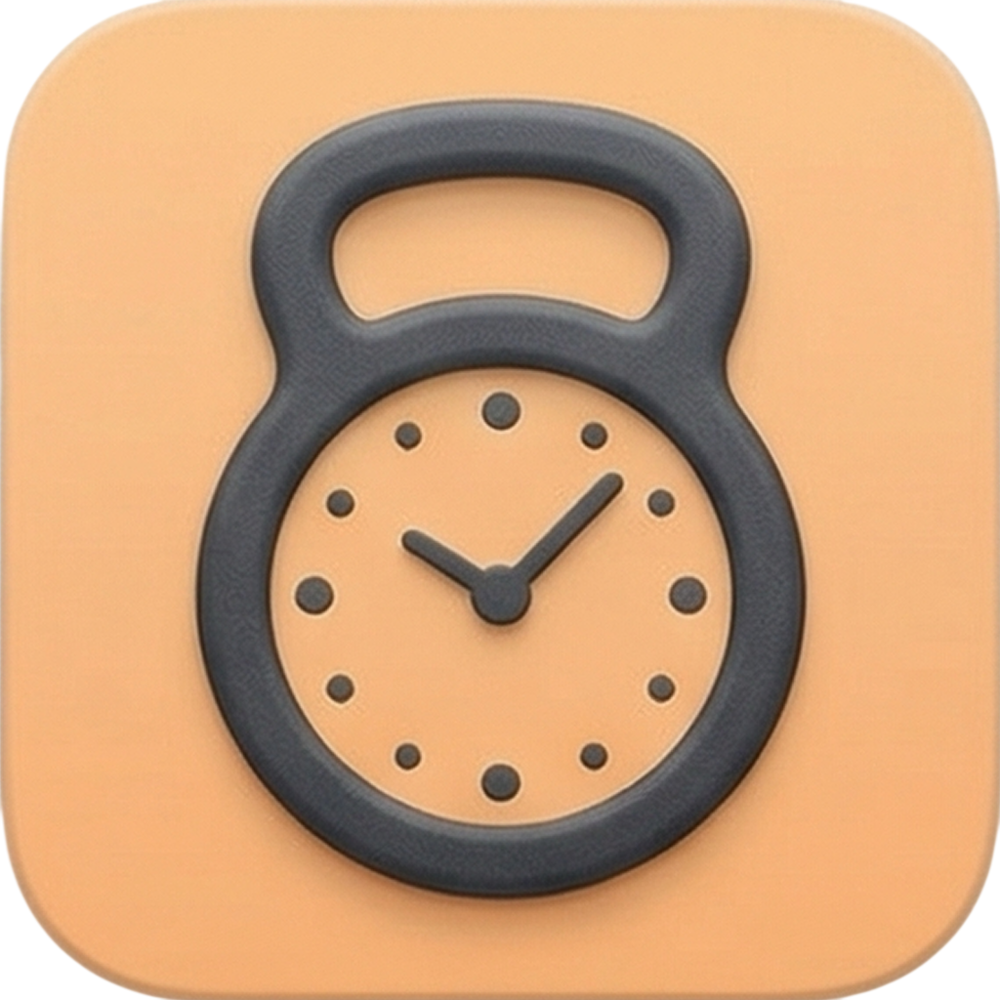

# 🏋️ Wake Up Fit

**The alarm clock you can't ignore.**

Wake Up Fit is an AI-powered fitness alarm clock that forces you to complete a real, verified physical workout to silence your alarm. No snooze. No dismiss. No escape.

<p align="center">
  
</p>

---

## 🎯 The Problem

57% of Americans hit snooze every morning, wasting **7.6 full days per year**. Every existing alarm app lets you cheat — math puzzles, barcode scans, phone shaking — all can be done half-asleep, **lying in bed**.

The problem isn't waking up. **It's getting UP.**

## 🚀 The Solution

Wake Up Fit uses an on-device AI agent powered by Apple's Vision framework to watch you through the camera and count real exercise reps in real time. The alarm sound loops indefinitely until you **physically complete a full set of verified exercises**.

### How It Works

1. **Set your alarm** — Apple-style alarm UI, familiar and intuitive
2. **Alarm rings** — No snooze, no dismiss, loops forever
3. **Do the workout** — AI tracks 19 body joints at 30fps
4. **Earn your silence** — Complete the set, alarm stops, you're awake

## 🛠️ AI Agent Architecture

```
┌───────────────────────────────────────────────────┐
│                PERCEPTION LAYER                    │
│  AVFoundation Camera → 30fps Video Stream          │
│  Vision Framework → 19-Joint Body Pose Detection   │
│  Multi-Person Filtering → Closest Person Selection │
└─────────────────────┬─────────────────────────────┘
                      ▼
┌───────────────────────────────────────────────────┐
│              REASONING / PLANNING LAYER            │
│  Scale-Invariant Position Calculation              │
│  5-Second Neutral Pose Calibration                 │
│  4-Phase State Machine (Ready→Down→Target→Up)      │
│  Ambient Movement Rejection                        │
└─────────────────────┬─────────────────────────────┘
                      ▼
┌───────────────────────────────────────────────────┐
│                  ACTION LAYER                      │
│  Real-Time HUD Feedback (Progress Bar + Rep Count) │
│  Audio Cues on Rep Completion                      │
│  Alarm Termination on Verified Workout Completion  │
└───────────────────────────────────────────────────┘
```

### Key Agent Capabilities

| Capability | Implementation |
|-----------|----------------|
| **Autonomous Perception** | 19-joint body pose detection at 30fps via Apple Vision |
| **Self-Calibration** | 5-second neutral pose lock for clean baseline |
| **Scale Invariance** | Torso-length normalization — works at any camera distance |
| **Multi-Person Handling** | Largest bounding box selection for correct user |
| **Noise Rejection** | Ambient movement (walking, fidgeting) filtered out |
| **Exercise-Specific Reasoning** | Per-exercise state machines with hysteresis thresholds |

## 📱 Features

- **Apple-Style Alarm Clock** — 1:1 replica of iOS Clock alarm UX
- **3 Exercise Types** — Pushups, Squats, Jumping Jacks
- **Random Exercise Selection** — Slot machine reel with unlimited respins
- **Real-Time Skeleton Overlay** — Visual feedback of tracked joints
- **Looping Alarm Sound** — Repeats every 3 seconds until workout is complete
- **Critical Alerts Support** — Entitlement applied for DND/Silent override
- **Custom Color Palette** — Warm Linen & Burnt Coral design system

## 🏗️ Tech Stack

| Layer | Technology |
|-------|-----------|
| UI | SwiftUI (iOS 17+) |
| Camera | AVFoundation real-time video pipeline |
| AI/ML | Apple Vision (`VNDetectHumanBodyPoseRequest`) |
| State Machine | Custom `ExerciseTracker` with 4-phase detection |
| Notifications | `UNUserNotificationCenter` |
| Audio | `AVAudioSession` + `AudioToolbox` |
| Persistence | `UserDefaults` |
| Build | XcodeGen |

## 📂 Project Structure

```
WakeUpFit/
├── Models/
│   ├── Alarm.swift              # Alarm data model
│   ├── AlarmSound.swift         # Selectable alarm tones
│   └── ExerciseType.swift       # Exercise definitions & joint requirements
├── Views/
│   ├── AlarmListView.swift      # Main alarm list (Apple-style)
│   ├── AddEditAlarmView.swift   # Add/Edit alarm sheet
│   ├── DayPickerView.swift      # Repeat day selection
│   ├── AlarmSoundPickerView.swift # Sound picker with preview
│   ├── WorkoutCameraView.swift  # Camera + workout flow
│   ├── WorkoutSelectorOverlay.swift # Slot machine exercise picker
│   ├── WorkoutHUDView.swift     # Progress bar & rep counter
│   ├── WorkoutCompleteView.swift # Completion celebration
│   └── SkeletonOverlayView.swift # Joint & bone visualization
├── Pose/
│   ├── PoseDetector.swift       # Vision framework pose extraction
│   └── ExerciseTracker.swift    # 4-phase state machine
├── Camera/
│   └── CameraManager.swift      # AVFoundation video pipeline
├── Utilities/
│   ├── Theme.swift              # Centralized color palette
│   ├── AlarmManager.swift       # Alarm persistence & notification scheduling
│   └── AlarmPlayer.swift        # Looping alarm sound controller
├── ContentView.swift
└── WakeUpFitApp.swift           # App entry point + notification delegate
```

## 🚀 Getting Started

### Prerequisites
- Xcode 15+
- iOS 17+ device or simulator
- [XcodeGen](https://github.com/yonaskolb/XcodeGen) installed (`brew install xcodegen`)

### Build & Run

```bash
# Clone the repo
git clone https://github.com/TaddyMason1/wakeupfit.git
cd wake-up-fit

# Generate Xcode project
xcodegen generate

# Open in Xcode
open WakeUpFit.xcodeproj

# Build and run on simulator or device
```

> **Note:** Camera-based pose detection requires a **physical device** for full functionality. The simulator supports the alarm and UI features.

## 💰 Business Model

**Freemium + Annual Subscription**

| | Free | Premium ($19.99/yr) |
|---|------|---------------------|
| Alarms | 1 | Unlimited |
| Exercises | 3 | All (+ Burpees, Planks, Lunges) |
| Sounds | Default | Custom alarm library |

### Market Validation
- **Alarmy** (closest competitor): 75M+ downloads, $11M+ annual revenue ([SensorTower](https://sensortower.com), [IndieHackers](https://indiehackers.com))
- Global fitness app market: **$17.7B** in 2025 ([The Business Research Company](https://thebusinessresearchcompany.com))
- Their missions are cognitive (math, photos). Ours require **physical movement** — the missing dimension.

## 📄 License

All rights reserved. © 2026 Wake Up Fit.
